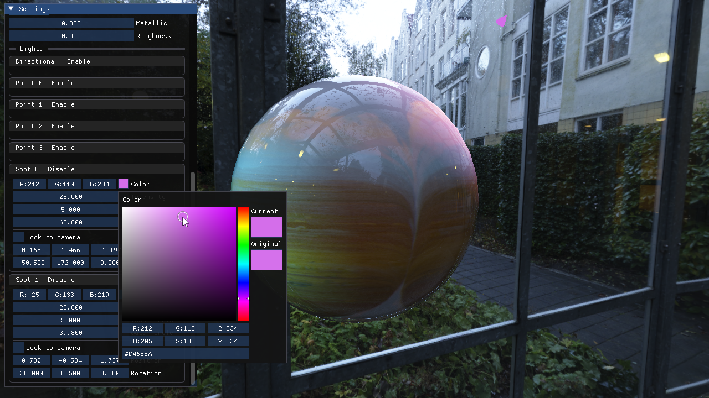
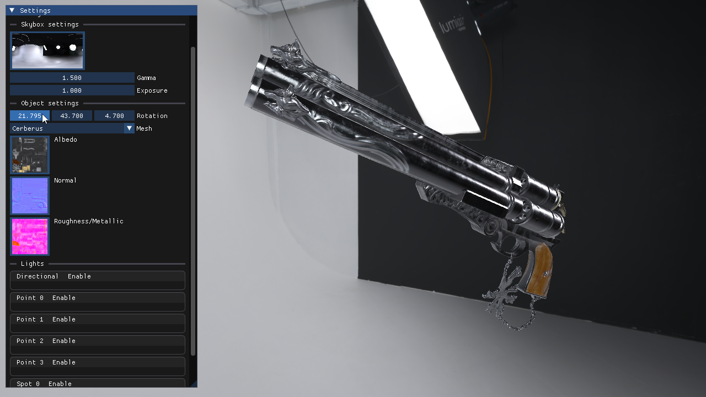
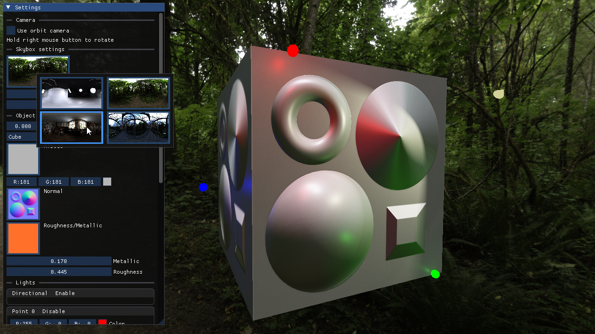

Quartz is a real-time rendering engine built to learn and practice both rendering techniques and greater engine architecture.
Originally meant to be a quick skeleton for experimenting with shaders, 

The majority of this project's core functionality has been built from scratch to gain the deepest possible understanding of how each system works. Each of these systems have been created as separate libraries to allow independent study and experimentation with each. These libraries include:
- [Opal](https://github.com/ReidYeager/Opal) : Graphics library
- [Peridot](https://github.com/ReidYeager/Peridot) : Mathematics library
- [Diamond](https://github.com/ReidYeager/Diamond) : Entity-Component-System library
- [Lapis](https://github.com/ReidYeager/Lapis) : Windowing library
	- Not currently included in Quartz directly, but its code has been copied in for slight modifications

## Plans
The current version of Quartz was built piece by piece as I encountered the need for or desire for new systems. Because of this I have collected a list of changes that I'd like to make to improve the usability, functionality, and performance of the engine.
A few of these planned changes/features, in no particular order:
- Raytracing
- Volumetrics
- Compute, mesh shaders
- Re-implement deferred rendering and shadows
- Post-process stack
- Customizable renderpasses
- Robust editor UI
- Architectural rewrite
- Multithreading/Jobs
- Animation
- OpenGL & D3D renderers
- Headless rendering

The source code for the images presented and released executable can be found in the [QuartzSandbox](https://github.com/ReidYeager/QuartzSandbox) repository